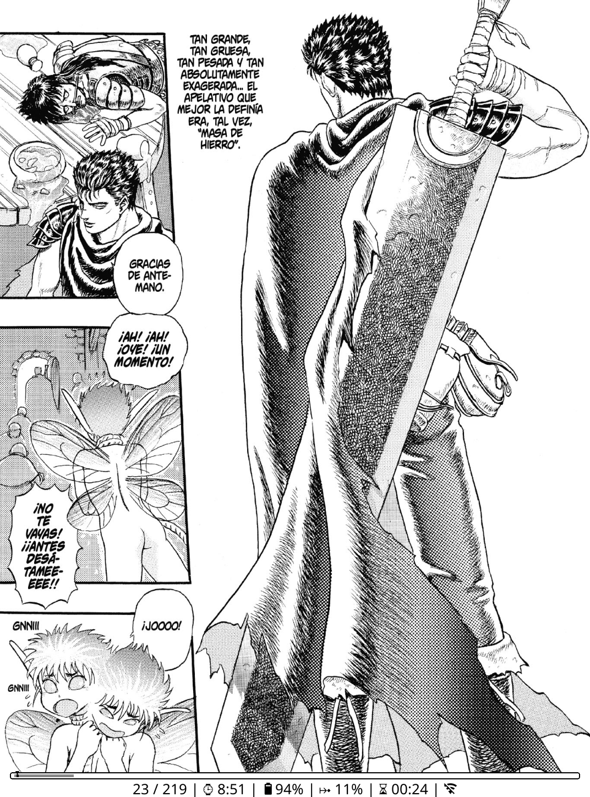
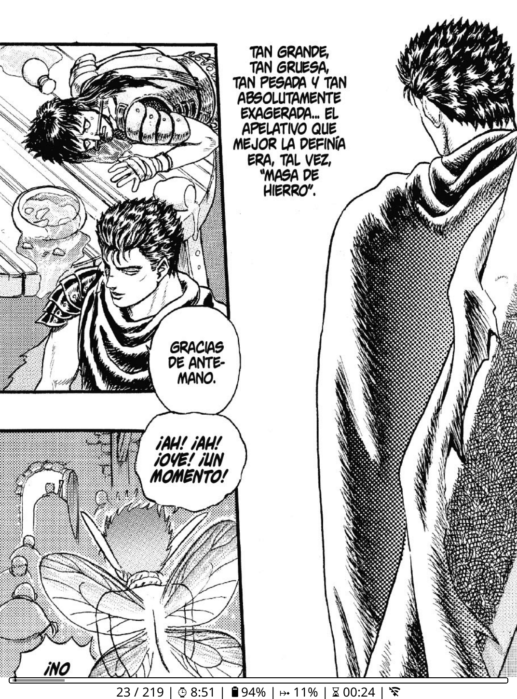
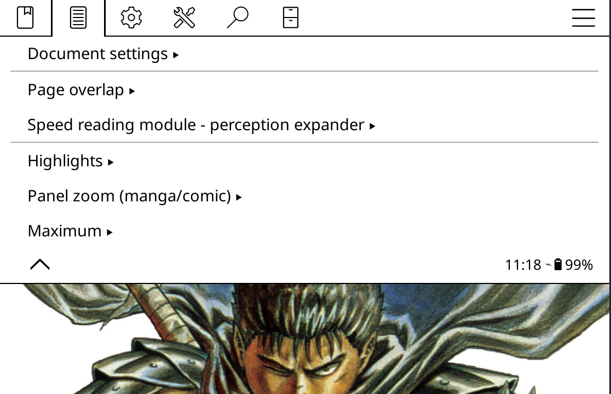
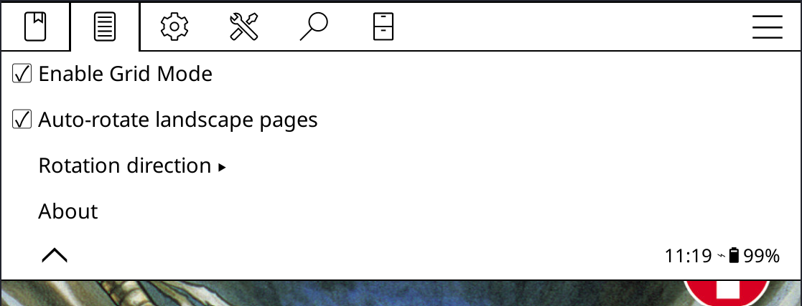

# LeadingMangaZoom Plugin for KOReader

> Forked from [Maximum](https://github.com/Shac0x/maximum.koplugin) by [@Shac0x](https://github.com/Shac0x)

## Overview
LeadingMangaZoom is a KOReader plugin that enhances the manga/comic reading experience. It provides grid-based quadrant zoom, automatic landscape page rotation, and landscape page splitting. Compatible with **CBZ**, **CBR**, and **PDF** formats.

---

## Screenshots

- **Without Zoom:**



- **With Zoom:**



- **Plugin Menu:**



- **Plugin Settings:**



---

## Features
- **Grid View**: Divides the screen into four quadrants (2×2) for easy navigation.
- **Zoom Functionality**: Two-finger tap on any quadrant to zoom it to fullscreen.
- **Page Zoom**: Spread gesture to zoom the entire page; pinch to zoom out.
- **RTL Mode**: Right-to-left reading direction when zoomed (for manga).
- **Auto-rotate**: Automatically rotates landscape pages to landscape orientation.
- **Rotation Direction**: Choose between clockwise (90°) or counter-clockwise (270°) rotation.
- **Page Split**: Splits landscape pages into two views (left half, then right half).
- **Persistent Settings**: Hold any option to save it as default.
- **Toggle Modes**: Enable or disable grid mode, auto-rotate, and page split independently.
- **Supported Formats**: Works with CBZ, CBR, and PDF files.

---

## Changes from Maximum

This fork includes the following bug fixes:

1. **Fixed zoom multiplier**: Quadrant zoom now actually zooms in (was `×1`, now `×2`).
2. **Fixed zoom mode**: Uses KOReader's `free` zoom mode for programmatic zoom control instead of `manual`.
3. **Fixed page split panning**: Replaced non-existent `GotoXPosBeg`/`GotoXPosEnd` events with direct `visible_area` manipulation for reliable left/right half navigation.
4. **Removed dead code**: Cleaned up unused variables and imports.
5. **Fixed zoom source**: Reads zoom level from `zooming.zoom` instead of unreliable `view.state.zoom`.

---

## How to Use

### Grid Mode
1. Open a CBZ, CBR, or PDF file.
2. Enable grid mode from the menu (**Leading Manga Zoom > Enable Grid Mode**).
3. Two-finger tap on any quadrant to zoom in.
4. Single tap or two-finger tap again to return to normal view.

### Page Zoom
1. Enable page zoom from the menu (**Leading Manga Zoom > Enable Page Zoom**).
2. Use the **spread** gesture (two fingers apart) to zoom into the page.
3. Use the **pinch** gesture (two fingers together) to zoom back out.

### RTL Mode (Right-to-Left)
1. Enable RTL mode from the menu (**Leading Manga Zoom > Grid RTL Mode**).
2. When zooming into a quadrant, the reading direction will change to right-to-left.
3. Ideal for reading manga in its native reading direction.
4. The original direction is restored when exiting zoom.

### Auto-rotate
1. Enable auto-rotate from the menu (**Leading Manga Zoom > Auto-rotate landscape pages**).
2. Choose rotation direction (**Leading Manga Zoom > Rotation direction**).
3. Landscape pages will automatically rotate when navigating.

### Page Split
1. Enable page split from the menu (**Leading Manga Zoom > Split landscape pages**).
2. Landscape pages will display in two halves: first the left half, then the right half.
3. Navigate normally to switch between halves and pages.
4. Note: Auto-rotate and Page Split are mutually exclusive.

### Save Defaults
- **Hold** any option to save it as the default setting.

---

## Installation
1. Copy the `leadingmangazoom.koplugin` folder to the KOReader plugins directory.
2. Restart KOReader to load the plugin.

---

## Menu Options
- **Enable Grid Mode**: Activates the grid view for supported files.
- **Enable Page Zoom**: Activates spread/pinch zoom for full page.
- **Grid RTL Mode**: Enables right-to-left reading direction when zoomed.
- **Auto-rotate landscape pages**: Automatically rotates landscape pages.
- **Rotation direction**: Choose clockwise or counter-clockwise rotation.
- **Split landscape pages**: Splits landscape pages into two views.
- **About**: Displays information about the plugin.

---

## File Structure
```
leadingmangazoom.koplugin/
├── _meta.lua       # Plugin metadata
├── main.lua        # Main plugin coordinator
├── autorotate.lua  # Auto-rotation module
├── grid.lua        # Grid zoom module
├── pagesplit.lua   # Page split module
├── menu.lua        # Menu module
└── settings.lua    # Persistent settings module
```

---

## Limitations
- Only supports CBZ, CBR, and PDF files.
- Requires a touch-enabled device.

---

## Credits
- Original plugin by [@Shac0x](https://github.com/Shac0x) — [maximum.koplugin](https://github.com/Shac0x/maximum.koplugin)
- Auto-rotate based on [koreader-autorotate](https://github.com/Extraltodeus/koreader-autorotate) by [@Extraltodeus](https://github.com/Extraltodeus)
- Fork maintained by [@Aur13l](https://github.com/Aur13l)

## License
This project is licensed under the GNU General Public License v3.0 — see the [LICENSE](LICENSE) file for details.
